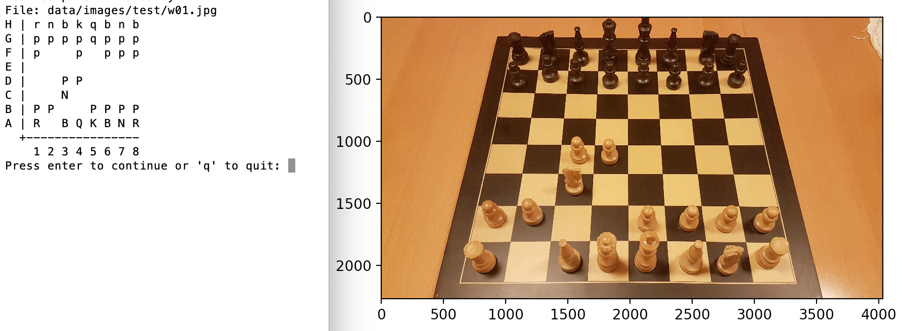

# Identify chess positions using machine learning
[](https://app.circleci.com/pipelines/github/georgw777/chess)

> [!CAUTION]
> This repository is deprecated. Please use [chesscog](https://github.com/georg-wolflein/chesscog) instead.

## Aim
The aim of this project is to develop a program that given an image of a chess board can recognize the position (and ultimately convert it to [PGN](https://en.wikipedia.org/wiki/Portable_Game_Notation)).

## Current progress

The `demo.py` script shows an image. The user will select the four corners of the board, and then the neural network will predict the position on the chess board. This is then displayed to the user.

## Approach
The current solution uses the Inception-V3 architecure with a custom head consisting of the following layers: 
- global average pooling
- dropout (.5)
- dense (64 units using ReLU)
- dropout (.2)
- dense (32 units using ReLU)
- dense (13 units using softmax), representing 6 different pieces in black and white, or an empty square using a one-hot encoding

The model was trained and fine-tuned from the pre-trained imagenet weights on Google Colab (see [the notebook here](train.ipynb)).

The network takes as input a batch of 300x300 pixel images and classifies what chess piece the image contains (there is also a class representing an empty square).
This means that the input to the network is not the image of the entire chess board, but rather a cropped image from each of the squares. 

The accuracy on the validation set was >99%.

Currently, the tensorflow program is able to perform the cropping itself.

Inputs:
- a batch of images
- for each image, the four (x, y) coordinates of the four corners of the chess board

Outputs:
- for each of the 8x8 squares, a probability distribution over the 13 classes

## Usage
Install the dependencies:
```bash
poetry install
./download_data.sh
```

Run the demo:
```bash
poetry run python demo.py
```

Run tests:
```bash
poetry run pytest
```

## Known issues
- Towards the back of the board, empty squares are often classified as the piece that is below them. This is because squares at the back of the board are cropped with a greater height due to the perspective.

## To do
- Use object detection instead of classification to achieve more reliable results, as this would avoid the known issue explained above (under development in the [`feature/object-detection`](tree/feature/object-detection) branch).
- Automate the detection of the four corners using a multi-headed model.
- Convert the output to PGN so it can be analysed directly on [lichess](http://lichess.org).
